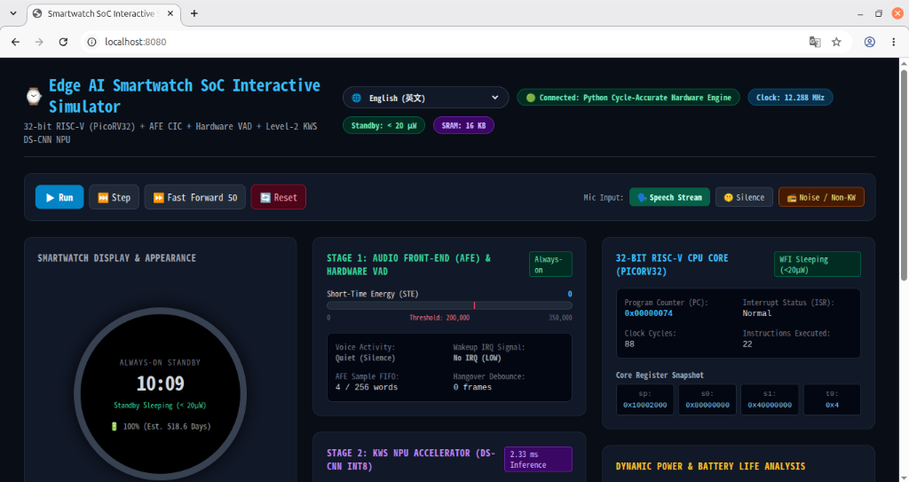

# ⌚ Edge AI 智慧手錶 SoC 晶片設計與模擬驗證平台

[繁體中文](README.md) | [English](README_EN.md) | [日本語](README_JA.md)

本專案為應用於超低功耗智慧手錶的 **兩級語音喚醒（Two-Stage Voice Wakeup）系統單晶片（SoC）**。包含演算法黃金模型、Verilog RTL 硬體描述、RISC-V 嵌入式韌體、以及具備圖形化介面（Web GUI）的週期與位元精確模擬器。

<p align="center">
  
  <br>
  <em>▲ 具備多國語言即時切換、硬體狀態機動態追蹤與功耗即時分析的視覺化 Web GUI 模擬器介面</em>
</p>

---

## 🚀 30 秒快速上手 (Quick Start)

無需安裝複雜的 EDA 工具或外部編譯鏈，只要有 Python 3 即可直接運行所有功能：

### 1. 啟動視覺化互動 Web GUI 模擬器 (最推薦)
```bash
python3 sim/web_server.py 8080
```
開啟瀏覽器前往：**`http://localhost:8080/`**
- **🌐 多國語言 (i18n)**：介面頂部內建語言選單，支援 **繁體中文 (Traditional Chinese)**、**English (英文)**、**简体中文 (Simplified Chinese)** 與 **日本語 (Japanese)** 即時切換，並自動保存喜好設定。
- 可在瀏覽器中直接看到智慧手錶外觀錶盤、板載 LED、CPU PC/暫存器、VAD 短時能量條、NPU 卷積狀態機與即時動態功耗分析。
- 支援按鈕點擊：`單步執行 (Step)`、`連續運行 (Run)`、`語音串流 (Speech)`、`無聲環境 (Silence)` 與 `重設 (Reset)`。

### 2. 執行全晶片自動化回歸測試
```bash
python3 sim/run_simulator.py --mode regression --lang zh-TW
# 亦可指定其他語言: --lang en (English), --lang zh-CN (簡中), --lang ja (日本語)
```
自動檢驗五大項目：
1. RISC-V RV32I 指令集與記憶體讀寫
2. 音訊前端（PDM $\to$ 3 階 CIC 濾波器 $\to$ 256-word FIFO）
3. 第一級硬體 VAD 時域能量計算與中斷觸發
4. 第二級 KWS NPU（DS-CNN INT8）矩陣加速與推論得分
5. 全系統韌體開機、待機休眠與語音喚醒流程

### 3. 使用 GDB 風格命令列互動除錯器
```bash
python3 sim/run_simulator.py --mode interactive --lang zh-TW
```
- `step [N]`：單步執行 N 條指令，印出即時反彙編與暫存器數值變化。
- `break <addr>`：設定中斷點（例如 `break 0x10` 攔截中斷服務常式）。
- `regs`：傾印所有 32 顆 RISC-V 通用暫存器（標註 ABI 名稱）。
- `mem <addr> [len]`：檢視記憶體內容（支援十六進位與 ASCII）。
- `feed speech`：向麥克風前端注入測試語音串流。
- `lang [code]`：即時切換命令列語言（`zh-TW`, `en`, `zh-CN`, `ja`）。

### 4. 產生數位波形檔與視覺化儀表板
```bash
python3 sim/run_simulator.py --mode scenario --vcd sim/waves_soc.vcd --dashboard sim/simulator_dashboard.html
```
- 產生標準 IEEE 1364 `.vcd` 檔案，可直接使用 **GTKWave** 或 **PulseView** 檢視每一個時脈週期的數位訊號翻轉。
- 產生獨立式互動 HTML5 儀表板 [`sim/simulator_dashboard.html`](file:///home/tony/repo/projects/smart_watch/sim/simulator_dashboard.html)，同樣支援即時多國語言切換！

---

## 🏛️ 晶片硬體架構概觀

全系統所有特徵緩衝區與記憶體均常駐於晶片內（On-chip 16 KB SRAM），杜絕外部 DRAM 存取耗電：

```
+-----------------------------------------------------------------------------------+
|                           Smartwatch SoC 頂層架構                                  |
|                                                                                   |
|  [ 音訊輸入 ]             [ 記憶體子系統 ]               [ 核心運算單元 ]         |
|  1.024MHz PDM 麥克風       0x0000_0000: 8KB Boot ROM     32-bit RISC-V CPU        |
|       │                    0x1000_0000: 8KB Data SRAM    (PicoRV32 RV32I)         |
|       ▼                                                       ▲                   |
|  [ AFE 前端 ]             [ 系統匯流排與 APB ]                 │ (中斷線)          |
|  - 3階 CIC 降頻 (R=64)     0x4000_0000: KWS Subsystem ───────┼── irq[0]: VAD 喚醒 |
|  - 256-word 音訊 FIFO      0x8000_0000: 除錯 LED 暫存器        └── irq[1]: NPU 完成 |
|       │                                                                           |
|       ▼ (16kHz PCM)                                                               |
|  [ 第一級：硬體 VAD (Always-on) ]  ────────────── 語音偵測 ───────────┐           |
|  - 160點時短能量累加 (< 20μW)                                         │           |
|                                                                       ▼           |
|  [ 第二級：KWS NPU 加速器 ] ◄──────────────────────────────── 喚醒 CPU 載入特徵  |
|  - 16x16 INT8 特徵 RAM (0x400)                                                    |
|  - 256B 權重 RAM (0x500)                                                          |
|  - DS-CNN (Conv1 -> DW -> PW -> GAP -> FC, 28,688 週期, 2.33ms)                   |
|  - 輸出 Class 0 (背景雜音) 與 Class 1 (喚醒詞) 得分                               |
+-----------------------------------------------------------------------------------+
```

---

## 📂 專案目錄結構指引

```text
smart_watch/
├── docs/                       # 設計規格與說明文件
│   ├── developer_onboarding_guide.md  # 🔰 新進開發人員快速入門指引
│   ├── simulator_guide.md             # 模擬器架構與詳細操作手冊
│   ├── system_architecture.md         # 系統模組架構與時序規範
│   └── register_map.md                # APB 暫存器對應手冊
├── model/                      # Python 演算法黃金模型
│   ├── generate_stimulus.py           # 音訊訊號產生器 (PDM/PCM 測試樣本)
│   ├── golden_vad.py                  # VAD 短時能量黃金模型
│   ├── golden_mfcc.py                 # MFCC 特徵萃取黃金模型
│   ├── golden_npu.py                  # DS-CNN INT8 定點推論模型
│   └── golden_vectors/                # 導出的標準測試向量與權重
├── rtl/                        # Verilog 硬體電路描述
│   ├── afe/                           # PDM 接收、CIC 降頻濾波器、音訊 FIFO
│   ├── vad/                           # 第一級 Always-on 硬體 VAD 核心
│   ├── npu/                           # 第二級 KWS NPU MAC 陣列與狀態機
│   ├── cpu/                           # 32-bit RISC-V PicoRV32 CPU
│   ├── bus/                           # APB 匯流排適配器
│   └── top/                           # 異質 SoC 頂層電路
├── sim/                        # 模擬驗證與視覺化介面
│   ├── simulator/                     # 週期精確 Python SoC 模擬器核心庫
│   │   ├── cpu.py, bus.py, afe.py, vad.py, npu.py, power.py, vcd.py, i18n.py ...
│   ├── run_simulator.py               # 統一模擬執行驅動程式 (支援 --lang 多國語言)
│   ├── run_sim.py                     # 回歸測試相容腳本
│   ├── web_server.py                  # 即時硬體 Web 伺服器後端
│   ├── smartwatch_simulator_ui.html   # 視覺化互動 HTML5 Web GUI (內建 i18n 即時切換)
│   ├── simulator_dashboard.html       # 獨立式全系統架構儀表板 (內建 i18n 即時切換)
│   └── waves_soc.vcd                  # 匯出的數位邏輯波形檔
└── sw/                         # 嵌入式韌體與工具鏈
    ├── app/                           # 應用程式源碼 (main.s, main.c)
    ├── include/                       # 暫存器巨集定義 (soc_regs.h)
    ├── build_firmware.py              # 純 Python 輕量 RISC-V 組譯器
    └── firmware.hex                   # 編譯產生的 32-bit 韌體機器碼
```

---

## 🛠️ 開發流程與常見工作

### 修改與重新編譯 RISC-V 韌體
韌體程式碼位於 [`sw/app/main.s`](file:///home/tony/repo/projects/smart_watch/sw/app/main.s)。修改後，執行純 Python 組譯器即可更新 `sw/firmware.hex`：
```bash
python3 sw/build_firmware.py sw/app/main.s sw/firmware.hex
```

### 調整 VAD 靈敏度門檻
可直接於軟體中寫入 `0x4000_0014`（`REG_VAD_THRESHOLD`），預設值為 `200000`。亦可修改 [`sw/app/main.s`](file:///home/tony/repo/projects/smart_watch/sw/app/main.s) 中的初始化參數。

### 查看詳細手冊
- 🔰 新人入職快速上手：[`docs/developer_onboarding_guide.md`](docs/developer_onboarding_guide.md) ([English](docs/en/developer_onboarding_guide.md) / [日本語](docs/ja/developer_onboarding_guide.md))
- 🕹️ 模擬器技術架構手冊：[`docs/simulator_guide.md`](docs/simulator_guide.md) ([English](docs/en/simulator_guide.md) / [日本語](docs/ja/simulator_guide.md))
- 🏛️ 系統架構設計規範：[`docs/system_architecture.md`](docs/system_architecture.md) ([English](docs/en/system_architecture.md) / [日本語](docs/ja/system_architecture.md))
- 📋 APB 暫存器手冊：[`docs/register_map.md`](docs/register_map.md) ([English](docs/en/register_map.md) / [日本語](docs/ja/register_map.md))
