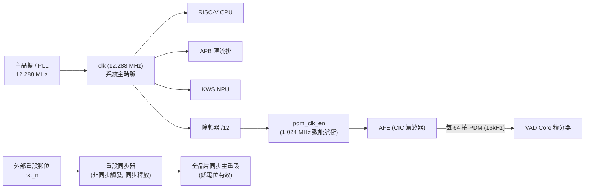
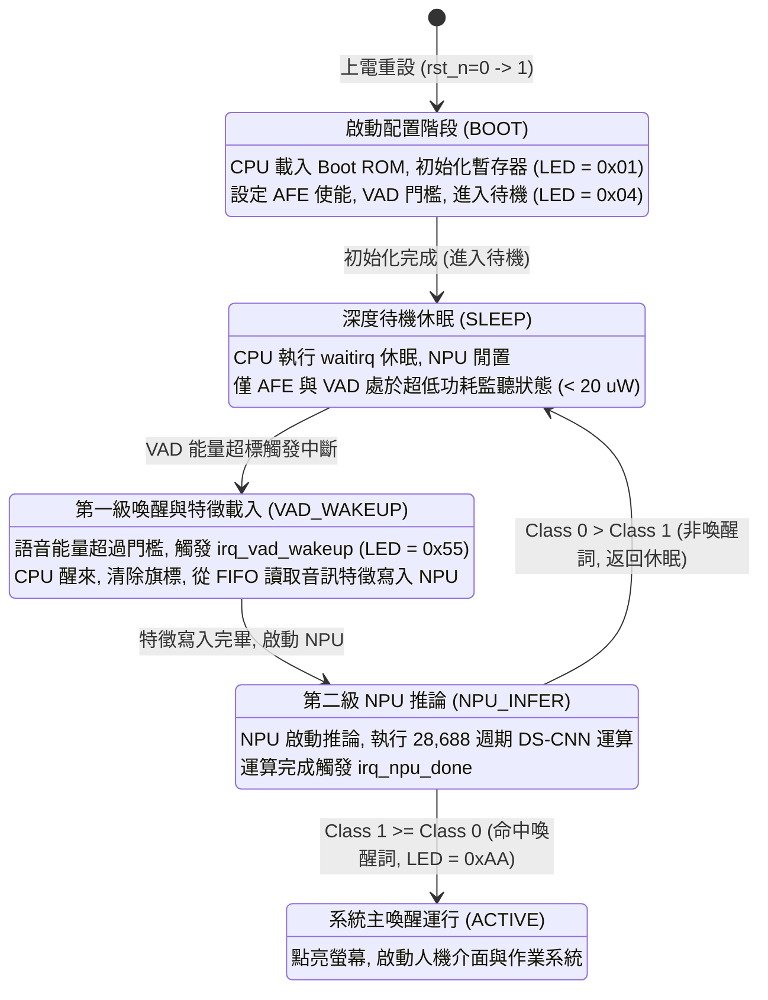

# 00 - 系統需求與架構規範書 (System Requirements Specification, SRS)

[繁體中文](00_system_requirements_spec.md) | [English](en/00_system_requirements_spec.md)

規格文件編號：`SPEC-SRS-001`  
版本：`1.0.0`  
狀態：`Approved / SSOT`

---

## 1. 系統目標與任務定義 (Mission Statement)

本專案旨在實現一款面向 **超低功耗 (Ultra-Low Power) 穿戴式智慧手錶** 的系統單晶片（SoC）。  
晶片核心任務為提供 **24 小時 Always-on、高靈敏度、低誤觸率的兩級語音喚醒功能 (Two-Stage Voice Wakeup)**，並嚴格受限於穿戴式設備的微型鋰電池（標準容量 200 mAh）供電條件。

### 1.1 兩級喚醒階層概念
1. **第一級 (Level-1)：硬體語音活動偵測 (Hardware VAD Core)**
   - 任務：於超低功耗常駐狀態下，即時分析麥克風時域短時能量。
   - 特性：純硬體邏輯，無 CPU 介入，待機功耗 $< 20\text{ }\mu\text{W}$。
   - 決策：若連續偵測到有效語音能量，發出硬體中斷喚醒 CPU。
2. **第二級 (Level-2)：關鍵字語音識別加速器 (KWS NPU Engine)**
   - 任務：執行深度可分離卷積神經網絡（DS-CNN），確認是否命中目標喚醒詞。
   - 特性：全程 INT8 定點矩陣運算，高能效比，推論耗時 $< 3\text{ ms}$。
   - 決策：若判定為目標關鍵詞，觸發系統主喚醒中斷點亮螢幕；若為環境雜音或非關鍵語音，CPU 立即返回深度休眠，杜絕無謂電量消耗。

---

## 2. 系統 PPA 預算與工程指標 (Power, Performance, Area Targets)

| 指標類別 | 參數名稱 | 規格數值 | 容許公差 / 上限 | 驗證基準與說明 |
|---|---|---|---|---|
| **功耗 (Power)** | 待機休眠功耗 (Standby Power) | $< 20\text{ }\mu\text{W}$ | 絕對上限 $35\text{ }\mu\text{W}$ | 僅 AFE 與 VAD 處於運作時脈，CPU 處於 `waitirq` |
| **功耗 (Power)** | 全速推論功耗 (Active Power) | $\approx 3.82\text{ mW}$ | 峰值 $< 5.0\text{ mW}$ | CPU、NPU、SRAM 同步全速運算 |
| **效能 (Perf)** | 主系統時脈頻率 ($F_{sys}$) | $12.288\text{ MHz}$ | $\pm 2\%$ ($12.0 \sim 12.5\text{ MHz}$) | 標準音訊倍頻（$16\text{ kHz} \times 768$） |
| **效能 (Perf)** | 麥克風 PDM 時脈 ($F_{pdm}$) | $1.024\text{ MHz}$ | 固定為 $F_{sys} / 12$ | 數位 MEMS 麥克風標準時脈 |
| **效能 (Perf)** | PCM 音訊取樣率 ($F_s$) | $16\text{ kHz}$ | 固定為 $F_{pdm} / 64$ | 3 階 CIC 濾波器降頻比 $R=64$ |
| **效能 (Perf)** | VAD 幀長度 (Frame Duration) | $10.0\text{ ms}$ | 固定 160 採樣點 | 短時絕對值能量積分視窗 |
| **效能 (Perf)** | NPU 總推論週期 (Latency Cycles) | $28,688\text{ cycles}$ | 固定值 (無外部動態停頓) | @ 12.288 MHz 換算約 **2.33 ms** |
| **面積 (Area)** | 邏輯等效門數 (Logic Gate Count) | $\sim 17,650\text{ Gates}$ | 嚴格上限 $< 25,000\text{ Gates}$ | 易於整合於平價 FPGA（Artix-7）或微型 ASIC |
| **記憶體 (Mem)** | 晶片內 SRAM 總量 (On-chip SRAM) | $16.0\text{ KB}$ | 嚴格上限 $< 64.0\text{ KB}$ | 8KB Boot ROM (ITCM) + 8KB Data RAM (DTCM) |
| **記憶體 (Mem)** | 外部記憶體依賴 (External DRAM) | **0 Byte (零依賴)** | 禁止使用外部 DRAM | 杜絕外部 DDR/SDRAM 引腳與刷新耗電 |
| **續航 (Battery)** | 預估電池連續工作壽命 | $> 10\text{ Days}$ | 典型場景 $\ge 7\text{ Days}$ | 基於 200 mAh 穿戴式鋰電池，待機佔比約 85% |

---

## 3. 時脈與重設架構 (Clocking & Reset Architecture)

### 3.1 時脈域規劃
- 全晶片採 **單一同步主時脈域 (`clk = 12.288MHz`)**，杜絕跨非同步時脈域 (CDC) 亞穩態與同步器延遲問題。
- PDM 與音訊處理採「時脈致能脈衝 (`pdm_clk_en`)」機制驅動，而非切換多重衍生時脈樹。

### 3.2 重設策略
- 系統重設信號：`rst_n`（低電位主動，Active Low）。
- 採用標準「非同步觸發、同步釋放 (Asynchronous Assert, Synchronous Deassert)」雙正反器同步設計。

---

## 4. 系統工作狀態機 (System Operational State Machine)

系統具備四個標準運作狀態：

---

## 5. 系統需求追蹤清單 (Traceability Requirements Matrix)

所有變更必須確保滿足以下需求：

| 需求 ID | 需求名稱 | 詳細技術要求 | 關聯模組 |
|---|---|---|---|
| `REQ-SYS-001` | 超低功耗待機 | 待機休眠模式下平均動態功耗嚴格不得超過 $20\text{ }\mu\text{W}$。 | `vad_core.v`, `power.py` |
| `REQ-SYS-002` | 晶片內記憶體限制 | 總 SRAM 不得大於 64 KB，標準出廠配置限定為 16 KB (8KB ROM + 8KB RAM)。 | `smartwatch_soc_top.v` |
| `REQ-SYS-003` | 零外部記憶體 | 禁止使用外部 SDRAM/DDR 控制器與實體 Pin 腳。 | `smartwatch_soc_top.v` |
| `REQ-SYS-004` | 音訊取樣規格 | 支援 1.024 MHz PDM 輸入，降頻為 16 kHz / 16-bit PCM 音訊串流。 | `pdm_receiver.v`, `cic_decimator_q64.v` |
| `REQ-SYS-005` | 第一級 VAD 即時性 | VAD 必須在 1 個音訊幀（160 個 PCM 取樣點，10.0 ms）結束時完成能量判定與中斷發出。 | `vad_core.v` |
| `REQ-SYS-006` | 第二級 NPU 延遲 | NPU DS-CNN 完整前向推論必須在 30,000 週期內完成（標準參考值 28,688 週期，$< 2.5\text{ ms}$）。 | `npu_top.v`, `mac_array_4x4.v` |
| `REQ-SYS-007` | INT8 量化算術 | NPU 推論全鏈路必須遵循對稱 INT8 乘加與算術右移截斷，禁止浮點運算器。 | `npu_top.v`, `golden_npu.py` |
| `REQ-SYS-008` | 雙級中斷機制 | 提供 VAD 喚醒中斷 (`irq[0]`) 與 NPU 完成中斷 (`irq[1]`)，支援 EOI 清除握手。 | `kws_accelerator_subsys.v`, `picorv32.v` |
| `REQ-SYS-009` | APB3 匯流排標準 | 暫存器與特徵/權重 RAM 存取必須 100% 符合 AMBA 3 APB 通訊規範。 | `apb_slave_adapter.v` |
| `REQ-SYS-010` | 零外部套件軟體驗證 | 全系統 Python 模擬器必須完全基於標準函式庫實現，無任何第三方 C 編譯依賴。 | `sim/simulator/` |
