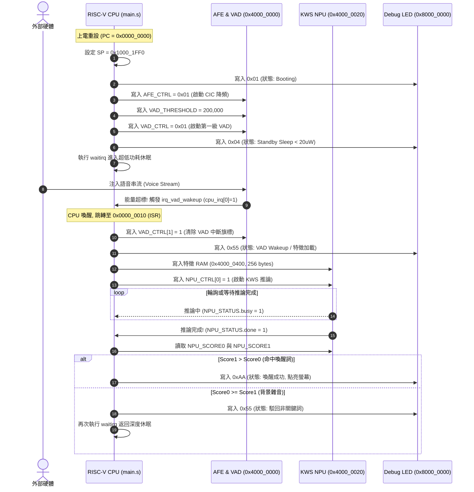

# 03 - 韌體與軟體架構規範書 (Firmware and Software Specification, SWS)

[繁體中文](03_firmware_and_software_spec.md) | [English](en/03_firmware_and_software_spec.md)

規格文件編號：`SPEC-SWS-001`  
版本：`1.0.0`  
狀態：`Approved / SSOT`

---

## 1. 處理器核心架構規範 (CPU Core Specification)

系統控制大腦採用 32-bit RISC-V 處理器核心（PicoRV32）：
- **指令集架構 (ISA)**：標準 **RV32I** 整數指令集。
- **硬體功能配置**：
  - 具備 32 顆 32-bit 通用整數暫存器（`x0` ~ `x31`，支援 ABI 別名）。
  - 支援硬體桶形移位器 (Barrel Shifter)。
  - 支援計數器暫存器 (`RDCYCLE`, `RDTIME`, `RDINSTRET`)。
- **低功耗客製指令 (Custom Instruction)**：
  - **`waitirq`**：機器碼為 `.word 0x0000006b`。
  - 功能：使 CPU 立即暫停指令解碼與執行，凍結管線並進入超低功耗休眠，直到任意硬體中斷線（`cpu_irq != 0`）被拉高為止。

---

## 2. 記憶體佈局與向量表 (Memory Layout & Vector Table)

```
0x0000_0000 ┌──────────────────────────────────────┐
            │ 重設向量入口 (Reset Vector Entry)     │ -> j _start
0x0000_0004 │ 保留/未用空間                         │
0x0000_0010 ├──────────────────────────────────────┤
            │ 中斷陷阱入口 (Trap/ISR Vector Entry)   │ -> j _isr_handler
0x0000_0014 │ 韌體程式碼段 (.text)                  │
            │ 常數資料段 (.rodata)                 │
0x0000_1FFF └──────────────────────────────────────┘ (8 KB ITCM / Boot ROM)

0x1000_0000 ┌──────────────────────────────────────┐
            │ 全域變數段 (.data / .bss)             │
            │ 特徵快取緩衝區 (Audio Frame Buffer)   │
            │                ▼                     │ (堆疊向下增長)
0x1000_1FF0 │ 初始堆疊指針 (Initial Stack Pointer)  │ (SP = 0x1000_1FF0)
0x1000_1FFF └──────────────────────────────────────┘ (8 KB DTCM / Data RAM)
```

---

## 3. 韌體開機與主迴圈狀態流程 (Boot & Main Flow)

韌體原始碼位於 [`sw/app/main.s`](file:///home/tony/repo/projects/smart_watch/sw/app/main.s)。開機與執行狀態機如下：



---

## 4. 除錯 LED 狀態編碼規範 (Debug LED State Codes)

寫入記憶體位址 `0x8000_0000` 之 8-bit LED 狀態碼定義如下：

| LED 數值 (Hex) | 二進位顯示 | 系統目前狀態 | 意義與說明 |
|---|---|---|---|
| `0x00` | `0000_0000` | **Power-On Reset** | 剛重設完成，CPU 尚未開始執行初始化 |
| `0x01` | `0000_0001` | **Booting** | 正在執行韌體初始化常式 |
| `0x02` | `0000_0010` | **AFE & VAD Configured** | 音訊前端與 VAD 門檻設定完畢 |
| `0x04` | `0000_0100` | **Standby Sleep** | 進入深度休眠，Always-on 待機（功耗 $< 20\text{ }\mu\text{W}$） |
| `0x55` | `0101_0101` | **VAD Wakeup / Feature Load** | 偵測到語音活動，正在進行推論或駁回非喚醒詞 |
| `0xAA` | `1010_1010` | **Keyword Hit!** | 成功命中喚醒詞！觸發手錶螢幕點亮與主系統運作 |
| `0xFF` | `1111_1111` | **System Fault / Trap** | 發生非預期例外或硬體錯誤 |

---

## 5. 韌體編譯與組譯工具鏈規格 (Assembler Toolchain)

專案內建純 Python 編寫的輕量級 RISC-V 組譯器 [`sw/build_firmware.py`](file:///home/tony/repo/projects/smart_watch/sw/build_firmware.py)。

### 5.1 執行指令
```bash
python3 sw/build_firmware.py sw/app/main.s sw/firmware.hex
```

### 5.2 支援指令清單
- **運算類 (R-Type / I-Type)**：`ADD`, `ADDI`, `SUB`, `AND`, `ANDI`, `OR`, `ORI`, `XOR`, `XORI`, `SLL`, `SLLI`, `SRL`, `SRLI`, `SRA`, `SRAI`, `SLT`, `SLTI`
- **高位立即數 (U-Type)**：`LUI`, `AUIPC`
- **記憶體存取 (Load / Store)**：`LW`, `SW`, `LH`, `SH`, `LB`, `SB`, `LBU`, `LHU`
- **分支與跳轉 (B-Type / J-Type)**：`BEQ`, `BNE`, `BLT`, `BGE`, `BLTU`, `BGEU`, `JAL`, `JALR`
- **偽指令 (Pseudo Ops)**：`NOP`, `LI`, `LA`, `MV`, `J`, `JR`, `RET`
- **客製休眠指令**：`.word 0x0000006b` (`waitirq`)

### 5.3 輸出檔案規範
- 輸出格式：標準十六進位純文字檔 [`sw/firmware.hex`](file:///home/tony/repo/projects/smart_watch/sw/firmware.hex)。
- 每行包含一個 8 碼十六進位 32-bit Little-Endian 機器碼（如 `00001137`），供 Verilog `$readmemh` 或 Python 模擬器直接載入。

---

## 6. 軟體需求追蹤清單 (Traceability Requirements)

| 需求 ID | 技術驗證標的 |
|---|---|
| `REQ-FW-001` | 開機初始重設向量必須位於 `0x0000_0000`，中斷陷阱向量位於 `0x0000_0010`。 |
| `REQ-FW-002` | 堆疊指針 SP 初始值必須設定於 `0x1000_1FF0`。 |
| `REQ-FW-003` | 進入待機前，必須依序配置 `AFE_CTRL`、`VAD_THRESHOLD` 與 `VAD_CTRL`。 |
| `REQ-FW-004` | 必須使用 `waitirq` 進入低功耗休眠，並在進入時將 LED 更新為 `0x04`。 |
| `REQ-FW-005` | VAD 中斷觸發後，ISR 必須明確寫入 `VAD_CTRL[1] = 1` 完成清除。 |
| `REQ-FW-006` | 分類決策若為目標喚醒詞，LED 必須輸出 `0xAA`；若非喚醒詞則更新為 `0x55` 並返回休眠。 |
