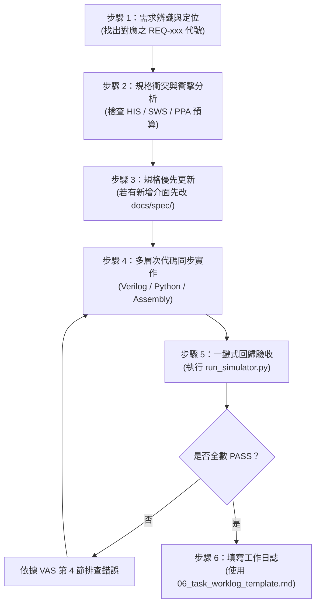

# 05 - AI Agent 開發與維護實踐指引 (AI Agent Development Guide, AGD)

[繁體中文](05_ai_agent_development_guide.md) | [English](en/05_ai_agent_development_guide.md)

規格文件編號：`SPEC-AGD-001`  
版本：`1.0.0`  
狀態：`Approved / SSOT`

---

## 1. AI Agent 憲章與行為準則 (AI Agent Charter)

本文件專為接手本專案的 **自主 AI Coding Agent**（例如 Gemini、Claude、GPT、Cursor、Antigravity、Roo Code 等）所制定。  
在進行任何代碼閱讀、功能擴充、Bug 修復或重構時，AI Agent **必須** 將本規範視為最高行為準則。

### 核心三大鐵律 (The Three Golden Invariants)
1. **先查規格，後寫代碼 (Read Spec Before Writing Code)**：
   不得僅憑使用者提示詞憑空猜測暫存器位址、位元欄位或演算法常數。所有的介面必須於 [`01_hardware_interface_spec.md`](01_hardware_interface_spec.md) 查驗。
2. **三位一體，同步演進 (Trinity Synchronization)**：
   本專案由四大支柱構成：
   - 演算法黃金模型 (`model/`)
   - 數位硬體 RTL (`rtl/`)
   - 嵌入式韌體 (`sw/`)
   - 週期精確模擬器 (`sim/`)  
   若修改了其中任一層（例如新增暫存器或修改量化位元），**必須同步更新其餘三層及規格文件**。
3. **零退化交付 (Zero-Regression Gatekeeper)**：
   在結束任何對話輪次前，必須主動執行全套自動化回歸測試，並確認結果為 `100% PASS`：
   ```bash
   python3 sim/run_simulator.py --mode regression
   ```

---

## 2. AI Agent 任務執行六步法 (Standard Operating Procedure)



### 步驟說明細節：
- **步驟 1 (Requirement Intake)**：閱讀使用者需求，比對 [`00_system_requirements_spec.md`](00_system_requirements_spec.md) 中的需求追蹤矩陣。
- **步驟 2 (Impact Analysis)**：若要新增功能，檢查是否會突破 PPA 限制（待機功耗 $< 20\text{ }\mu\text{W}$、SRAM $< 64\text{ KB}$、NPU 推論延遲 $< 3\text{ ms}$）。
- **步驟 3 (Spec-First Update)**：若涉及暫存器或演算法變更，先編輯 `docs/spec/01_hardware_interface_spec.md` 或 `docs/spec/02_algorithm_and_golden_model_spec.md`。
- **步驟 4 (Implementation)**：遵循下述之 Verilog / Python / Assembly 編碼規範進行修改。
- **步驟 5 (Verification)**：執行回歸指令，檢驗是否 5 項測試全數綠燈。
- **步驟 6 (Worklog Handover)**：產出簡明扼要的摘要，附上驗證通過指令與結果截圖/輸出。

---

## 3. 各領域代碼編寫標準 (Domain-Specific Coding Standards)

### 3.1 Verilog HDL 硬體電路標準 (Synthesizable RTL Rules)
為確保 RTL 能夠順利於 Xilinx Vivado、Synopsys Design Compiler 等工業級 EDA 工具綜合，嚴禁寫出無法合成的語法：
1. **語法版本**：嚴格使用 **Verilog-2001** 標準。
2. **時序邏輯 (Sequential Logic)**：
   - 僅允許 `always @(posedge clk or negedge rst_n)`。
   - 所有暫存器賦值必須使用 **非阻塞賦值 (`<=`)**。
   - 必須具備完整的重設初始值。
3. **組合邏輯 (Combinational Logic)**：
   - 敏感列表使用 `always @(*)`。
   - 所有賦值必須使用 **阻塞賦值 (`=`)**。
   - `case` 或 `if-else` 敘述必須包含完整的 `default` 或 `else` 分支，**嚴禁產生鎖存器 (Latches)**。
4. **絕對禁止事項**：
   - ❌ 嚴禁在可合成 RTL 模組內使用延遲語句（如 `#10`）。
   - ❌ 嚴禁在可合成 RTL 模組內使用 `initial` 區塊（僅 Testbench 可用）。
   - ❌ 嚴禁跨時脈域信號無同步器直接相連。

### 3.2 Python 週期精確模擬器標準 (Python Simulator Rules)
模擬器是整個專案的靈魂，也是 AI Agent 驗收成果的快速通道：
1. **零外部函式庫依賴**：
   - 模擬器核心庫（[`sim/simulator/`](../../sim/simulator)）**嚴禁使用 `numpy`、`scipy`、`torch`** 等第三方套件。
   - 必須完全使用 Python 原生標準庫（`sys`, `os`, `struct`, `typing` 等）。
2. **位元精確整數運算**：
   - Python 整數為無限精度，因此在模擬 32-bit 暫存器運算時，必須主動進行遮罩與符號擴展：
     ```python
     # 32-bit 無符號截斷
     val_u32 = (val_a + val_b) & 0xFFFFFFFF
     
     # 32-bit 轉有符號整數 (Two's complement)
     val_s32 = val_u32 if val_u32 < 0x80000000 else val_u32 - 0x100000000
     ```
3. **多國語言國際化 (i18n)**：
   - 所有終端輸出字串與 Web GUI 提示，必須加入 [`sim/simulator/i18n.py`](../../sim/simulator/i18n.py) 中的多語字典（支援 `zh-TW`, `en`, `zh-CN`, `ja`）。

### 3.3 RISC-V 韌體與組合語言標準 (Firmware & Assembly Rules)
1. **原始碼位置**：修改 [`sw/app/main.s`](../../sw/app/main.s)。
2. **編譯驗證**：修改後必須立即執行組譯器更新機器碼：
   ```bash
   python3 sw/build_firmware.py sw/app/main.s sw/firmware.hex
   ```
3. **暫存器約定**：
   - 嚴格遵守 RISC-V Calling Convention（ABI 名稱）：
     - `a0` - `a7`：函式參數與回傳值。
     - `t0` - `t6`：臨時暫存器（呼叫者保存）。
     - `s0` - `s11`：保存暫存器（被呼叫者保存）。
     - `sp`：堆疊指針（必須保持 16-byte 對齊）。
4. **低功耗指令**：進入休眠必須使用 `.word 0x0000006b`（`waitirq`）。

---

## 4. 嚴格禁止事項清單 (The "NEVER" List)

AI Agent 在任何情況下 **絕對不可執行** 以下操作：
- 🚫 **NEVER** 提交未經過 `python3 sim/run_simulator.py --mode regression` 驗證的變更。
- 🚫 **NEVER** 自行在暫存器地圖中加入未經審核的位址（避免破壞 APB 譯碼邏輯）。
- 🚫 **NEVER** 在硬體 RTL 中引入浮點運算（Float/Double）。全晶片必須維持 INT8 / INT16 / INT32 定點數。
- 🚫 **NEVER** 將晶片內 SRAM 擴充至大於 64 KB，不可加入外部 DDR 控制器。
- 🚫 **NEVER** 刪除或略過 5 大回歸測試中的任何一項斷言（Assert）。
- 🚫 **NEVER** 擅自更改 `sw/include/soc_regs.h` 與 `docs/spec/01_hardware_interface_spec.md` 中的暫存器偏移值而不保持兩者同步。

---

## 5. AI Agent 交付自我查核清單 (Self-Audit Checklist)

在宣告任務完成並回覆使用者前，請逐一檢查：

- [ ] 1. 是否已明確查閱相關的 `REQ-xxx` 規格條文？
- [ ] 2. 若有增修暫存器，`docs/spec/01_hardware_interface_spec.md` 與 `sw/include/soc_regs.h` 是否已同步？
- [ ] 3. 若有修改組合語言，是否已執行 `python3 sw/build_firmware.py sw/app/main.s sw/firmware.hex`？
- [ ] 4. 若有修改演算法，是否已執行 `python3 sim/run_sim.py` 更新黃金向量？
- [ ] 5. 是否執行過 `python3 sim/run_simulator.py --mode regression` 且 5 項測試皆為 `PASS`？
- [ ] 6. 回應中是否附帶了可點擊的檔案連結（如 `[main.s](file:///home/tony/repo/projects/smart_watch/sw/app/main.s)`）？
