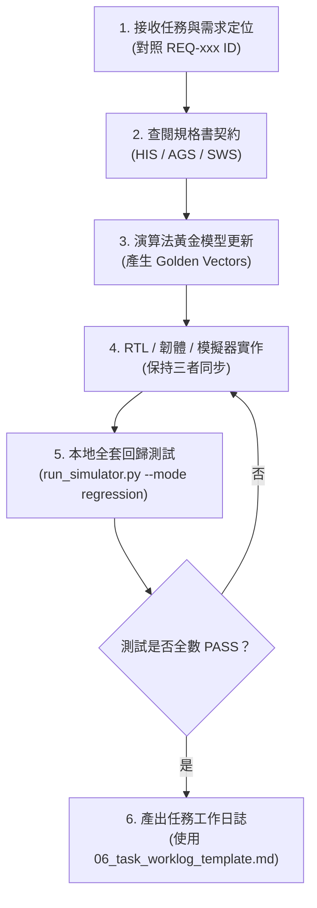

# 📑 規格驅動開發 (Spec-Driven Development, SDD) 總綱與 AI Agent 指南

[繁體中文](README.md) | [English](en/README.md) | [System Requirements](00_system_requirements_spec.md) | [Hardware Interface](01_hardware_interface_spec.md) | [Algorithm & Golden](02_algorithm_and_golden_model_spec.md) | [Firmware Spec](03_firmware_and_software_spec.md) | [Verification Spec](04_verification_and_acceptance_spec.md) | [AI Agent Guide](05_ai_agent_development_guide.md)

---

## 1. 什麼是規格驅動開發 (Spec-Driven Development)？

**規格驅動開發 (Spec-Driven Development, SDD)** 是一種以「形式化規格文件為單一真實來源 (Single Source of Truth, SSOT)」的系統工程方法。

在傳統軟硬體協同設計（尤其是包含演算法、數位 IC、RISC-V 韌體與週期模擬器的異質系統）中，人工維護與 AI 輔助開發最常面臨的痛點是：
1. **介面漂移 (Interface Drift)**：暫存器位址、欄位定義在韌體標頭檔與硬體 Verilog 之間脫節。
2. **定點數精度不一致 (Bit-True Mismatch)**：Python 浮點演算法與硬體 INT8 運算截斷/捨入規則不同步。
3. **時序與通訊協定幻覺 (Protocol Hallucination)**：AI Agent 自行捏造未定義的匯流排握手信號或指令集。
4. **無效驗證 (Lack of Verifiable Contracts)**：修改代碼後缺乏一鍵式、全覆蓋的通過/失敗判準。

本目錄（`docs/spec/`）即為本專案全體開發者（人類工程師與自主 AI Agent）的 **最高契約準則**。任何功能擴充、錯誤修復或重構，均須嚴格依循規格文件的定義與驗收流程。

---

## 2. 規格文件清單與架構體系

本專案規格體系由上而下劃分為 7 份模組化規格，並具有嚴格的需求追蹤 ID（Requirements Traceability）：

```
docs/spec/
├── README.md                           # [本文件] SDD 框架總綱與導讀指南
├── 00_system_requirements_spec.md       # [SRS] 系統層級需求、PPA 目標與架構狀態機
├── 01_hardware_interface_spec.md        # [HIS] APB 匯流排協定、暫存器位元映射與中斷架構
├── 02_algorithm_and_golden_model_spec.md# [AGS] CIC 降頻、VAD 短時能量與 DS-CNN INT8 量化算式
├── 03_firmware_and_software_spec.md     # [SWS] 記憶體佈局、啟動流程、ISR 中斷處理與組譯規範
├── 04_verification_and_acceptance_spec.md # [VAS] 驗證標準、回歸測試套件與位元精確判準
├── 05_ai_agent_development_guide.md     # [AGD] AI Agent 開發指引、操作規範與防呆手冊
└── 06_task_worklog_template.md          # [TMP] AI Agent 工作日誌與變更簽核範本
```

### 文件職責分工矩陣

| 規格代號 | 規格文件名稱 | 核心職責 | 涵蓋需求 ID | 主要受眾 |
|---|---|---|---|---|
| **SRS** | [`00_system_requirements_spec.md`](00_system_requirements_spec.md) | 定義系統功能、功耗（<20μW）、面積（<20k門）、記憶體（16KB）上限 | `REQ-SYS-*` | 系統架構師、AI Agent |
| **HIS** | [`01_hardware_interface_spec.md`](01_hardware_interface_spec.md) | 定義 APB3 匯流排時序、位元級暫存器定義、中斷握手、頂層 Pinout | `REQ-BUS-*` | 數位 IC、韌體、AI Agent |
| **AGS** | [`02_algorithm_and_golden_model_spec.md`](02_algorithm_and_golden_model_spec.md) | 定義數學轉換公式、INT8 定點化縮放、量化飽和規則與標準測試向量格式 | `REQ-ALG-*` | 演算法、驗證、AI Agent |
| **SWS** | [`03_firmware_and_software_spec.md`](03_firmware_and_software_spec.md) | 定義 ITCM/DTCM 映射、重設/中斷常式、LED 狀態碼、純 Python 組譯器規格 | `REQ-FW-*` | 韌體工程師、AI Agent |
| **VAS** | [`04_verification_and_acceptance_spec.md`](04_verification_and_acceptance_spec.md) | 定義 5 大回歸測試關卡、位元吻合判準、週期延遲容許值、故障診斷流 | `REQ-VERIF-*` | 驗證工程師、CI/CD、AI Agent |
| **AGD** | [`05_ai_agent_development_guide.md`](05_ai_agent_development_guide.md) | 規範 AI Agent 的工作流、唯讀/寫入邊界、禁止行為、自我驗收清單 | `RULE-AI-*` | Autonomous AI Agents |
| **TMP** | [`06_task_worklog_template.md`](06_task_worklog_template.md) | AI Agent 完成任務時提交的結構化日誌格式 | N/A | AI Agent, Reviewer |

---

## 3. AI Agent 核心運作準則 (The Core Commandments for AI Agents)

任何在專案中執行任務的 AI Agent **必須** 遵守以下五大基本原則：

1. **契約至上 (Contract First)**：
   在修改任何 Verilog RTL、Python 模擬器或 RISC-V 組合語言前，必須先查閱 [`01_hardware_interface_spec.md`](01_hardware_interface_spec.md) 與 [`03_firmware_and_software_spec.md`](03_firmware_and_software_spec.md)。嚴禁擅自發明未在規格定義的暫存器位址或指令。
2. **位元精確 (Bit-True Invariance)**：
   演算法模型（[`model/`](../../model)）、數位硬體（[`rtl/`](../../rtl)）與週期精確模擬器（[`sim/simulator/`](../../sim/simulator)）三者之間的計算結果必須具備 **100% 位元精確一致性**。
3. **資源硬性約束 (Resource Hard Budgets)**：
   - 晶片內記憶體總和不得超出 **64 KB**（目前配置 16 KB SRAM：8KB Boot ROM + 8KB Data SRAM）。
   - 杜絕任何外部 DRAM 依賴。
   - 待機功耗必須符合 $< 20\text{ }\mu\text{W}$ 設計標準。
4. **綠燈回歸交付 (Green Regression Handover)**：
   任何任務結束前的必要交付條件是執行：
   ```bash
   python3 sim/run_simulator.py --mode regression
   ```
   **5 項回歸測試必須全數通過 (PASS)**，不可有任何退化（Regression）。
5. **變更可追蹤性 (Traceability)**：
   每次修改代碼必須在工作摘要中標註所關聯的 Requirement ID（如 `REQ-VAD-002`）。

---

## 4. AI Agent 開發工作流程 (6 步標準流程)



---

## 5. 快速上手查閱導航

- 想了解整個 SoC 的功耗、時脈、特徵尺寸？請查閱 👉 [`00_system_requirements_spec.md`](00_system_requirements_spec.md)
- 想知道某個暫存器的 Offset、讀寫權限與欄位意義？請查閱 👉 [`01_hardware_interface_spec.md`](01_hardware_interface_spec.md)
- 想了解 CIC 濾波器數學或 DS-CNN INT8 卷積運算過程？請查閱 👉 [`02_algorithm_and_golden_model_spec.md`](02_algorithm_and_golden_model_spec.md)
- 想編寫 RISC-V 組合語言或了解 ISR 流程？請查閱 👉 [`03_firmware_and_software_spec.md`](03_firmware_and_software_spec.md)
- 想知道如何驗證代碼是否正確、執行哪些測試指令？請查閱 👉 [`04_verification_and_acceptance_spec.md`](04_verification_and_acceptance_spec.md)
- AI Agent 如何避免幻覺、編寫可合成 Verilog 與標準 Python？請查閱 👉 [`05_ai_agent_development_guide.md`](05_ai_agent_development_guide.md)
