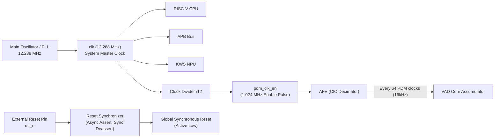
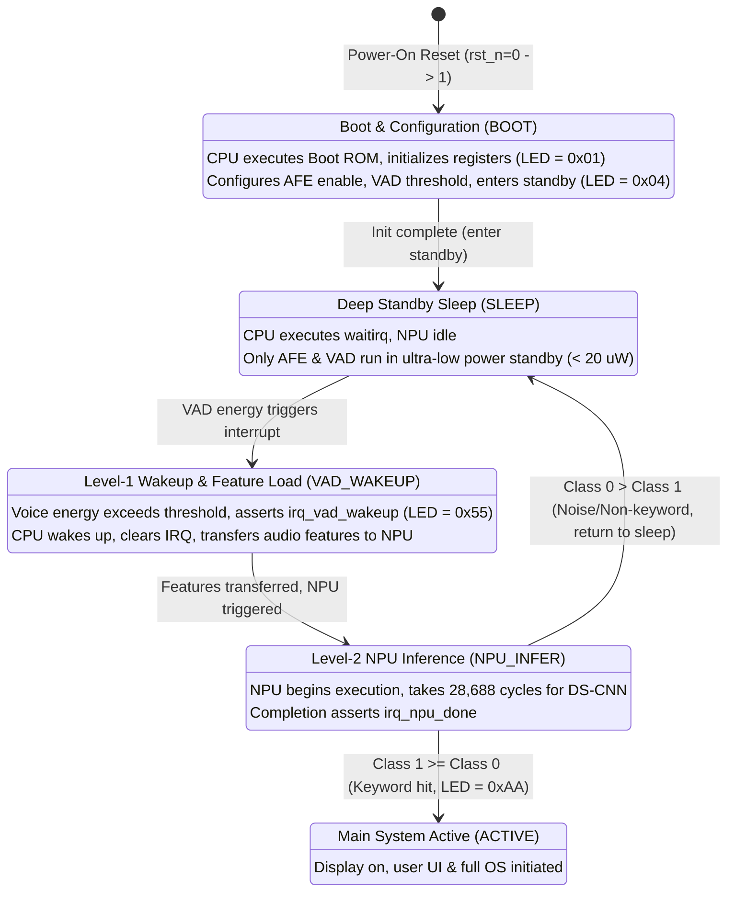

# 00 - System Requirements Specification (SRS)

Document ID: `SPEC-SRS-001-EN`  
Version: `1.0.0`  
Status: `Approved / SSOT`

---

## 1. System Mission & Operational Scope

This project implements an ultra-low power System-on-Chip (SoC) designed for wearable smartwatches.  
The core mission is to provide a **24/7 Always-on, highly sensitive, low false-alarm Two-Stage Voice Wakeup** solution, constrained strictly by wearable battery limits (typical capacity: 200 mAh).

### 1.1 Two-Stage Wakeup Hierarchy
1. **Level-1: Hardware Voice Activity Detection (Hardware VAD Core)**
   - Mission: Continuously monitor ambient acoustic energy in real-time under ultra-low power standby.
   - Characteristics: Pure hardware logic, zero CPU involvement, standby power $< 20\text{ }\mu\text{W}$.
   - Decision: When consecutive valid speech energy is detected, asserts an interrupt (`irq_vad_wakeup`) to wake up the CPU.
2. **Level-2: Keyword Spotting Accelerator (KWS NPU Engine)**
   - Mission: Execute a Depthwise Separable Convolutional Neural Network (DS-CNN) to determine if the target wakeup word was spoken.
   - Characteristics: 100% INT8 quantized matrix-vector operations, high energy efficiency, inference latency $< 3\text{ ms}$.
   - Decision: If the target keyword is detected, assert system wakeup to turn on the smartwatch display; if noise or non-keyword speech, the CPU immediately returns to deep sleep, preventing battery drain.

---

## 2. System PPA Budgets & Engineering Targets

| Metric Category | Parameter | Target Specification | Margin / Hard Ceiling | Verification Criteria & Notes |
|---|---|---|---|---|
| **Power** | Standby Sleep Power | $< 20\text{ }\mu\text{W}$ | Hard Max $35\text{ }\mu\text{W}$ | Only AFE & VAD running; CPU in `waitirq` |
| **Power** | Full Inference Active Power | $\approx 3.82\text{ mW}$ | Peak $< 5.0\text{ mW}$ | CPU, NPU, and SRAM running concurrently |
| **Performance**| Master System Clock ($F_{sys}$) | $12.288\text{ MHz}$ | $\pm 2\%$ ($12.0 \sim 12.5\text{ MHz}$) | Standard audio multiple ($16\text{ kHz} \times 768$) |
| **Performance**| Microphone PDM Clock ($F_{pdm}$)| $1.024\text{ MHz}$ | Fixed at $F_{sys} / 12$ | Standard digital MEMS microphone rate |
| **Performance**| PCM Audio Sample Rate ($F_s$) | $16\text{ kHz}$ | Fixed at $F_{pdm} / 64$ | 3rd-order CIC filter decimation ratio $R=64$ |
| **Performance**| VAD Frame Duration | $10.0\text{ ms}$ | Exactly 160 samples | Short-time absolute energy window |
| **Performance**| NPU Inference Latency | $28,688\text{ cycles}$ | Deterministic (no bus stalls) | @ 12.288 MHz corresponds to **2.33 ms** |
| **Area** | Logic Gate Count | $\sim 17,650\text{ Gates}$ | Hard Max $< 25,000\text{ Gates}$ | Fits low-cost FPGA (Artix-7) or small ASIC |
| **Memory** | Total On-Chip SRAM | $16.0\text{ KB}$ | Hard Max $< 64.0\text{ KB}$ | 8KB Boot ROM (ITCM) + 8KB Data RAM (DTCM) |
| **Memory** | External DRAM Dependency | **0 Bytes (None)** | Forbidden | Eliminates DDR/SDRAM pins & refresh power |
| **Battery Life**| Estimated Continuous Life | $> 10\text{ Days}$ | Typical $\ge 7\text{ Days}$ | 200 mAh battery, ~85% standby duty cycle |

---

## 3. Clocking & Reset Architecture

### 3.1 Clock Domain Strategy
- The SoC operates on a **single synchronous master clock domain (`clk = 12.288 MHz`)**, avoiding CDC (Clock Domain Crossing) synchronizer overhead and metastability issues.
- PDM and audio decimator circuits are driven using clock-enable pulses (`pdm_clk_en`) rather than gated derived clocks.

### 3.2 Reset Strategy
- System reset signal: `rst_n` (Active Low).
- Implements standard asynchronous assert, synchronous deassert via dual-flip-flop synchronizers.

---

## 4. System Operational State Machine

---

## 5. System Requirements Traceability Matrix

All modifications must verify compliance against the following requirements:

| Requirement ID | Requirement Title | Technical Specification | Associated Modules |
|---|---|---|---|
| `REQ-SYS-001` | Ultra-Low Power Standby | Standby mode average dynamic power must not exceed $20\text{ }\mu\text{W}$. | `vad_core.v`, `power.py` |
| `REQ-SYS-002` | On-Chip Memory Ceiling | Total on-chip SRAM must not exceed 64 KB; baseline is 16 KB (8KB ROM + 8KB RAM). | `smartwatch_soc_top.v` |
| `REQ-SYS-003` | Zero External Memory | External DRAM/SDRAM controllers and pins are strictly prohibited. | `smartwatch_soc_top.v` |
| `REQ-SYS-004` | Audio Sampling Specs | Supports 1.024 MHz PDM input decimated to 16 kHz / 16-bit signed PCM audio. | `pdm_receiver.v`, `cic_decimator_q64.v` |
| `REQ-SYS-005` | Level-1 VAD Latency | VAD must complete energy evaluation and IRQ generation at the end of each 10 ms frame (160 samples). | `vad_core.v` |
| `REQ-SYS-006` | Level-2 NPU Latency | DS-CNN forward inference must complete within 30,000 cycles (nominal: 28,688 cycles, $< 2.5\text{ ms}$). | `npu_top.v`, `mac_array_4x4.v` |
| `REQ-SYS-007` | INT8 Quantized Math | NPU pipeline must be 100% symmetric INT8 multiply-accumulate and arithmetic shifts; no FPU. | `npu_top.v`, `golden_npu.py` |
| `REQ-SYS-008` | Dual-Level IRQs | Provides VAD wakeup IRQ (`irq[0]`) and NPU done IRQ (`irq[1]`) with EOI software clear. | `kws_accelerator_subsys.v`, `picorv32.v` |
| `REQ-SYS-009` | APB3 Bus Compliance | All registers and SRAM access windows must adhere to AMBA 3 APB protocol. | `apb_slave_adapter.v` |
| `REQ-SYS-010` | Zero-Dependency Sim | SoC simulator must be 100% standard Python 3.8+ with zero third-party C/C++ build requirements. | `sim/simulator/` |
