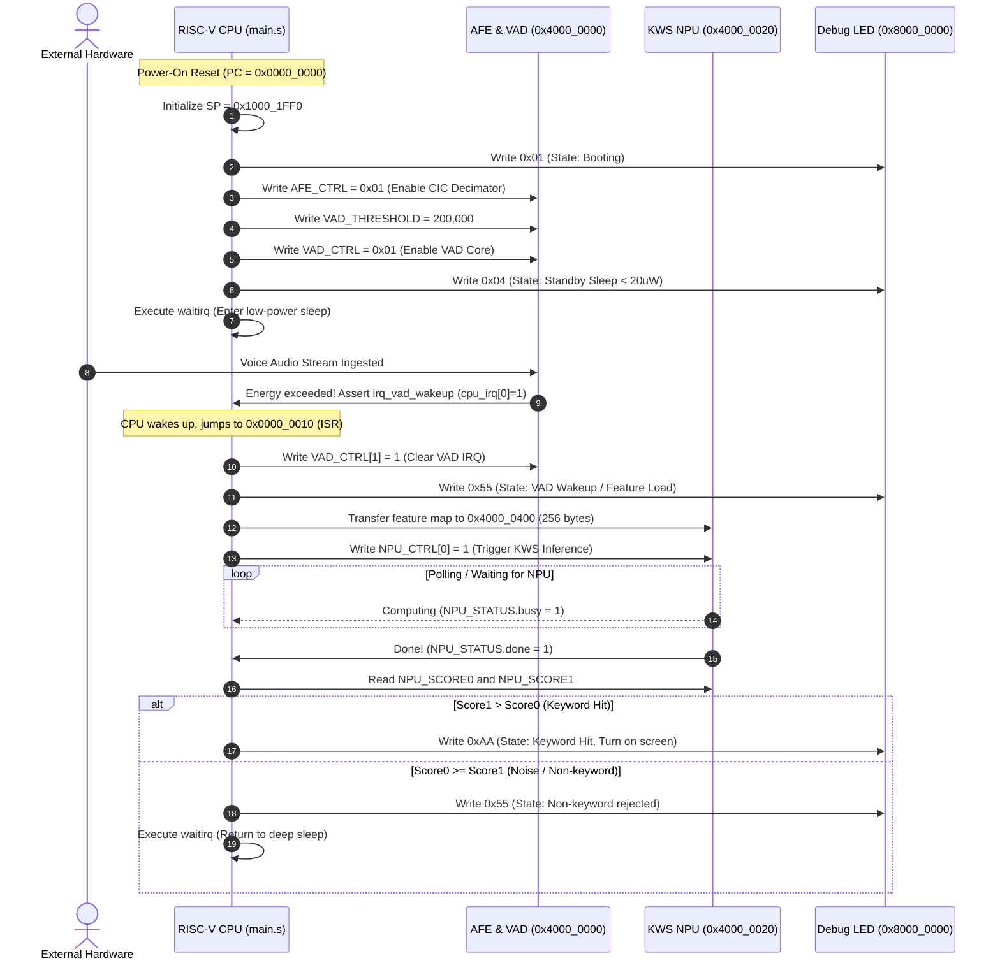

# 03 - Firmware and Software Specification (SWS)

Document ID: `SPEC-SWS-001-EN`  
Version: `1.0.0`  
Status: `Approved / SSOT`

---

## 1. CPU Core Architecture Specification

The system coordinator is a 32-bit RISC-V processor (PicoRV32):
- **Instruction Set Architecture (ISA)**: Baseline **RV32I** integer instruction set.
- **Hardware Configuration**:
  - 32 general-purpose 32-bit integer registers (`x0` through `x31`, with standard ABI aliases).
  - Hardware Barrel Shifter enabled.
  - Cycle counters (`RDCYCLE`, `RDTIME`, `RDINSTRET`) supported.
- **Custom Low-Power Instruction**:
  - **`waitirq`**: Encoded as `.word 0x0000006b`.
  - Behavior: Halts CPU pipeline fetch/decode and puts core into ultra-low power standby until any interrupt line (`cpu_irq != 0`) is asserted.

---

## 2. Memory Layout & Vector Tables

```
0x0000_0000 ┌──────────────────────────────────────┐
            │ Reset Vector Entry                   │ -> j _start
0x0000_0004 │ Reserved Space                       │
0x0000_0010 ├──────────────────────────────────────┤
            │ Interrupt Trap Entry (ISR)           │ -> j _isr_handler
0x0000_0014 │ Firmware Instructions (.text)        │
            │ Read-Only Constants (.rodata)        │
0x0000_1FFF └──────────────────────────────────────┘ (8 KB ITCM / Boot ROM)

0x1000_0000 ┌──────────────────────────────────────┐
            │ Global Data (.data / .bss)           │
            │ Audio Frame Buffer                   │
            │                ▼                     │ (Stack grows downwards)
0x1000_1FF0 │ Initial Stack Pointer (SP)           │ (SP = 0x1000_1FF0)
0x1000_1FFF └──────────────────────────────────────┘ (8 KB DTCM / Data RAM)
```

---

## 3. Firmware Boot & ISR Execution Flow

Firmware source is located in [`sw/app/main.s`](file:///home/tony/repo/projects/smart_watch/sw/app/main.s):



---

## 4. Debug LED State Codes

Status written to address `0x8000_0000`:

| Hex Code | Binary Representation | System State | Meaning & Operational Context |
|---|---|---|---|
| `0x00` | `0000_0000` | **Power-On Reset** | Hardware reset active; CPU boot pending |
| `0x01` | `0000_0001` | **Booting** | Initializing CPU registers and stack |
| `0x02` | `0000_0010` | **AFE & VAD Ready** | Peripherals and thresholds configured |
| `0x04` | `0000_0100` | **Standby Sleep** | CPU in `waitirq` standby (< 20 μW) |
| `0x55` | `0101_0101` | **VAD Wakeup / Feature Load** | Voice detected, feature loaded, or non-keyword rejected |
| `0xAA` | `1010_1010` | **Keyword Hit!** | Target keyword confirmed! Screen turns on |
| `0xFF` | `1111_1111` | **System Fault / Trap** | Unexpected CPU exception or hardware fault |

---

## 5. Firmware Build Toolchain Specification

The repository includes a pure Python RISC-V assembler [`sw/build_firmware.py`](file:///home/tony/repo/projects/smart_watch/sw/build_firmware.py).

### 5.1 Build Command
```bash
python3 sw/build_firmware.py sw/app/main.s sw/firmware.hex
```

### 5.2 Supported Instruction Set
- **ALU Operations (R-Type / I-Type)**: `ADD`, `ADDI`, `SUB`, `AND`, `ANDI`, `OR`, `ORI`, `XOR`, `XORI`, `SLL`, `SLLI`, `SRL`, `SRLI`, `SRA`, `SRAI`, `SLT`, `SLTI`
- **Upper Immediate (U-Type)**: `LUI`, `AUIPC`
- **Memory Operations**: `LW`, `SW`, `LH`, `SH`, `LB`, `SB`, `LBU`, `LHU`
- **Branches & Jumps**: `BEQ`, `BNE`, `BLT`, `BGE`, `BLTU`, `BGEU`, `JAL`, `JALR`
- **Pseudo-ops**: `NOP`, `LI`, `LA`, `MV`, `J`, `JR`, `RET`
- **Custom Sleep Instruction**: `.word 0x0000006b` (`waitirq`)

### 5.3 Output Artifact
- Generates standard 32-bit hex text file [`sw/firmware.hex`](file:///home/tony/repo/projects/smart_watch/sw/firmware.hex) formatted for Verilog `$readmemh` and the Python simulator.

---

## 6. Software Requirements Traceability Matrix

| Requirement ID | Technical Assertion |
|---|---|
| `REQ-FW-001` | Reset vector must reside at `0x0000_0000`; interrupt trap vector at `0x0000_0010`. |
| `REQ-FW-002` | Initial Stack Pointer (SP) must be set to `0x1000_1FF0`. |
| `REQ-FW-003` | Before entering sleep, firmware must configure `AFE_CTRL`, `VAD_THRESHOLD`, and `VAD_CTRL`. |
| `REQ-FW-004` | Must invoke `waitirq` to enter sleep and set LED to `0x04`. |
| `REQ-FW-005` | Upon VAD interrupt, ISR must write `VAD_CTRL[1] = 1` to clear the hardware latch. |
| `REQ-FW-006` | Keyword hits must output LED `0xAA`; non-keyword rejections must output `0x55` and sleep. |
