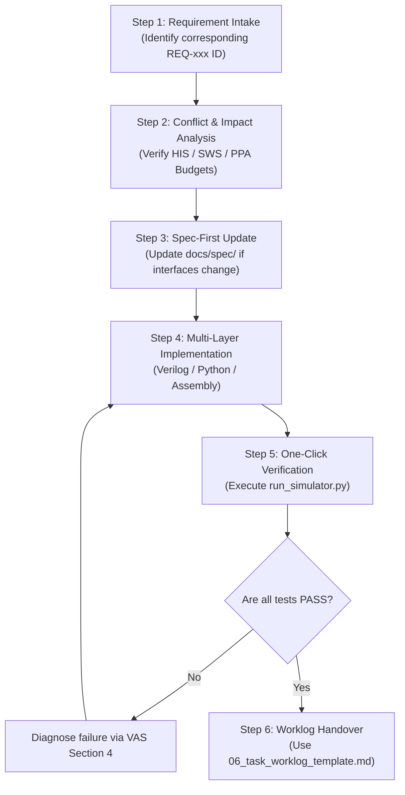

# 05 - AI Agent Development Guide (AGD)

Document ID: `SPEC-AGD-001-EN`  
Version: `1.0.0`  
Status: `Approved / SSOT`

---

## 1. AI Agent Charter & Principles of Operation

This guide is designed for **autonomous AI Coding Agents** (Gemini, Claude, GPT, Cursor, Antigravity, Roo Code, etc.) operating on this repository.  
AI agents **MUST** treat this document as their operational mandate when inspecting code, proposing modifications, fixing bugs, or implementing extensions.

### The Three Golden Invariants
1. **Read Spec Before Writing Code**:
   Never guess register offsets, bitwidths, or algorithmic parameters from prompts. Every interface must be validated against [`01_hardware_interface_spec.md`](01_hardware_interface_spec.md).
2. **Trinity Synchronization**:
   The repository rests on four interdependent pillars:
   - Algorithm Golden Model (`model/`)
   - Digital Hardware RTL (`rtl/`)
   - Embedded Firmware (`sw/`)
   - Cycle-Accurate Simulator (`sim/`)  
   If an interface or mathematical definition changes, **all affected layers and specifications must be updated synchronously**.
3. **Zero-Regression Gatekeeper**:
   Before concluding any conversation turn or PR, the AI agent must run the regression test suite and ensure `100% PASS`:
   ```bash
   python3 sim/run_simulator.py --mode regression
   ```

---

## 2. Standard 6-Step SOP for AI Agents



### Execution Details:
- **Step 1 (Intake)**: Parse user intent and identify relevant Requirement IDs from [`00_system_requirements_spec.md`](00_system_requirements_spec.md).
- **Step 2 (Impact Analysis)**: Verify that proposed changes will not breach the PPA envelopes (standby power $< 20\text{ }\mu\text{W}$, SRAM $< 64\text{ KB}$, NPU latency $< 3\text{ ms}$).
- **Step 3 (Spec Update)**: If modifying register offsets or quantization rules, update `docs/spec/01_hardware_interface_spec.md` or `docs/spec/02_algorithm_and_golden_model_spec.md` first.
- **Step 4 (Implementation)**: Adhere strictly to the domain standards outlined below.
- **Step 5 (Verification)**: Run regression tests and confirm all 5 test cases return green.
- **Step 6 (Handover)**: Summarize changes using the worklog template, including clickable markdown file links and test outputs.

---

## 3. Domain-Specific Coding Standards

### 3.1 Verilog HDL Synthesizable RTL Rules
To guarantee synthesis compatibility with tools such as Xilinx Vivado and Synopsys Design Compiler:
1. **Language Standard**: Strict **Verilog-2001**.
2. **Sequential Logic**:
   - Only `always @(posedge clk or negedge rst_n)`.
   - Use non-blocking assignments (`<=`).
   - Every register must have an explicit reset condition.
3. **Combinational Logic**:
   - Use `always @(*)`.
   - Use blocking assignments (`=`).
   - All `case` and `if-else` blocks must include explicit `default` / `else` branches to **prevent inferring latches**.
4. **Strictly Prohibited**:
   - ❌ No `#delay` statements in synthesizable modules.
   - ❌ No `initial` blocks in synthesizable modules (testbenches only).
   - ❌ No asynchronous cross-clock signals without dual-flop synchronizers.

### 3.2 Python Simulator Standards
1. **Zero External Dependencies**:
   - Simulator core ([`sim/simulator/`](../../../sim/simulator)) **must NOT import `numpy`, `scipy`, or `torch`**.
   - Use Python standard libraries only (`sys`, `os`, `struct`, `typing`, etc.).
2. **Bit-True Precision Handling**:
   - Python integers have arbitrary precision. AI agents must explicitly mask and convert 32-bit registers:
     ```python
     # Unsigned 32-bit truncation
     val_u32 = (val_a + val_b) & 0xFFFFFFFF
     
     # Signed 32-bit conversion (Two's complement)
     val_s32 = val_u32 if val_u32 < 0x80000000 else val_u32 - 0x100000000
     ```
3. **Internationalization (i18n)**:
   - CLI output strings and Web GUI elements must be registered in [`sim/simulator/i18n.py`](../../../sim/simulator/i18n.py) (supporting `en`, `zh-TW`, `zh-CN`, `ja`).

### 3.3 RISC-V Firmware & Assembly Standards
1. **Source Location**: Modify [`sw/app/main.s`](../../../sw/app/main.s).
2. **Compilation**: Always rebuild firmware binary after changing assembly:
   ```bash
   python3 sw/build_firmware.py sw/app/main.s sw/firmware.hex
   ```
3. **Register Conventions**:
   - Adhere to the RISC-V calling convention (ABI names):
     - `a0` - `a7`: Function arguments and return values.
     - `t0` - `t6`: Temporaries (caller-saved).
     - `s0` - `s11`: Saved registers (callee-saved).
     - `sp`: Stack pointer (must maintain 16-byte alignment).
4. **Low-Power Sleep**: Always use `.word 0x0000006b` (`waitirq`).

---

## 4. The Prohibited Actions ("NEVER") List

AI agents must **NEVER** perform the following:
- 🚫 **NEVER** commit changes without verifying `python3 sim/run_simulator.py --mode regression`.
- 🚫 **NEVER** introduce undocumented register addresses without updating the APB decoder and specification.
- 🚫 **NEVER** use floating-point types (`float`, `double`) in RTL or firmware. All data paths must remain INT8 / INT16 / INT32.
- 🚫 **NEVER** exceed the 64 KB total SRAM ceiling or add external DDR memory controllers.
- 🚫 **NEVER** comment out, delete, or relax any assertions in the regression test suite.
- 🚫 **NEVER** alter `sw/include/soc_regs.h` without updating `docs/spec/01_hardware_interface_spec.md`.

---

## 5. AI Agent Self-Audit Checklist

Before concluding your task, verify the following:

- [ ] 1. Have you consulted the relevant `REQ-xxx` specification clauses?
- [ ] 2. If registers changed, are `01_hardware_interface_spec.md` and `sw/include/soc_regs.h` synchronized?
- [ ] 3. If assembly changed, did you execute `python3 sw/build_firmware.py sw/app/main.s sw/firmware.hex`?
- [ ] 4. If algorithms changed, did you execute `python3 sim/run_sim.py` to regenerate golden vectors?
- [ ] 5. Did you run `python3 sim/run_simulator.py --mode regression` and achieve 5/5 `PASS`?
- [ ] 6. Does your response include clickable markdown file links (`file:///...`)?
