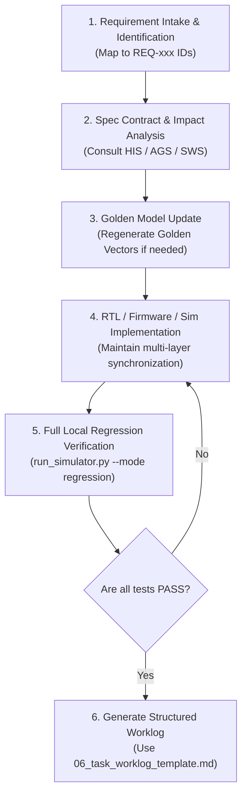

# 📑 Spec-Driven Development (SDD) Framework & AI Agent Master Guide

[繁體中文](../README.md) | [English](README.md) | [System Requirements](00_system_requirements_spec.md) | [Hardware Interface](01_hardware_interface_spec.md) | [Algorithm & Golden](02_algorithm_and_golden_model_spec.md) | [Firmware Spec](03_firmware_and_software_spec.md) | [Verification Spec](04_verification_and_acceptance_spec.md) | [AI Agent Guide](05_ai_agent_development_guide.md)

---

## 1. What is Spec-Driven Development (SDD)?

**Spec-Driven Development (SDD)** is a systems engineering methodology where **formal specification documents serve as the Single Source of Truth (SSOT)**.

In heterogeneous hardware/software co-design—spanning algorithm modeling, digital RTL, RISC-V embedded firmware, and cycle-accurate simulators—development and AI agent collaboration face common failure modes:
1. **Interface Drift**: Register offsets and bitfield definitions drift apart between firmware C/assembly headers and Verilog RTL.
2. **Bit-True Precision Mismatches**: Python floating-point algorithm calculations desynchronize from hardware INT8 rounding, shifting, and saturation.
3. **Protocol & Timing Hallucinations**: AI agents fabricate undocumented bus handshake signals, timing assumptions, or non-existent instructions.
4. **Lack of Verifiable Contracts**: Code modifications lack deterministic, one-click, 100% test passing criteria.

This specification directory (`docs/spec/`) constitutes the **binding contract** for all developers—both human engineers and autonomous AI agents. Any feature additions, bug fixes, or refactoring must strictly conform to these specifications and pass the defined acceptance suites.

---

## 2. Specification Structure & Hierarchy

The specification suite is structured into 7 modular documents with rigorous requirement traceability IDs:

```
docs/spec/en/
├── README.md                           # [This Document] SDD Framework & Master Index
├── 00_system_requirements_spec.md       # [SRS] System requirements, PPA targets, and operational states
├── 01_hardware_interface_spec.md        # [HIS] AMBA APB3 bus protocol, register bitfields, and IRQ contracts
├── 02_algorithm_and_golden_model_spec.md# [AGS] CIC decimation, VAD STE math, and DS-CNN INT8 neural network
├── 03_firmware_and_software_spec.md     # [SWS] Memory map, boot flow, ISR handling, and assembler rules
├── 04_verification_and_acceptance_spec.md # [VAS] Verification pyramid, 5 mandatory regression suites, and diagnosis
├── 05_ai_agent_development_guide.md     # [AGD] AI Agent standard operating procedure, coding rules, and guardrails
└── 06_task_worklog_template.md          # [TMP] Standard task worklog and sign-off template
```

### Document Ownership Matrix

| Spec Code | Document Title | Primary Scope | Covered IDs | Target Audience |
|---|---|---|---|---|
| **SRS** | [`00_system_requirements_spec.md`](00_system_requirements_spec.md) | System goals, power (<20μW), area (<20k gates), memory (16KB) budgets | `REQ-SYS-*` | Architects, AI Agents |
| **HIS** | [`01_hardware_interface_spec.md`](01_hardware_interface_spec.md) | APB3 bus timing, bit-exact register maps, interrupt handshakes, pinouts | `REQ-BUS-*` | Digital IC, Firmware, AI Agents |
| **AGS** | [`02_algorithm_and_golden_model_spec.md`](02_algorithm_and_golden_model_spec.md) | Mathematical models, INT8 quantization scaling, bit growth, golden vectors | `REQ-ALG-*` | Algorithm, Verification, AI Agents |
| **SWS** | [`03_firmware_and_software_spec.md`](03_firmware_and_software_spec.md) | ITCM/DTCM layout, reset/trap vectors, LED status codes, assembler specs | `REQ-FW-*` | Firmware Engineers, AI Agents |
| **VAS** | [`04_verification_and_acceptance_spec.md`](04_verification_and_acceptance_spec.md) | 5 regression suites, bit-true criteria, cycle bounds, troubleshooting | `REQ-VERIF-*` | Verification, CI/CD, AI Agents |
| **AGD** | [`05_ai_agent_development_guide.md`](05_ai_agent_development_guide.md) | AI Agent SOP, read/write boundaries, synthesizable Verilog rules, never-list | `RULE-AI-*` | Autonomous AI Agents |
| **TMP** | [`06_task_worklog_template.md`](06_task_worklog_template.md) | Standardized task handover and requirement traceability log format | N/A | AI Agents, Reviewers |

---

## 3. The Core Commandments for AI Agents

All AI agents operating on this repository **MUST** adhere to five fundamental principles:

1. **Contract First**:
   Before modifying any Verilog RTL, Python simulator code, or RISC-V assembly, consult [`01_hardware_interface_spec.md`](01_hardware_interface_spec.md) and [`03_firmware_and_software_spec.md`](03_firmware_and_software_spec.md). Never invent undocumented register offsets or instructions.
2. **Bit-True Invariance**:
   The algorithm golden model ([`model/`](../../../model)), digital hardware RTL ([`rtl/`](../../../rtl)), and cycle-accurate simulator ([`sim/simulator/`](../../../sim/simulator)) **must maintain 100% bit-accurate mathematical equivalence**.
3. **Hard Resource Budgets**:
   - Total on-chip SRAM must not exceed **64 KB** (current configuration: 16 KB SRAM = 8KB Boot ROM + 8KB Data RAM).
   - Zero external DRAM dependencies.
   - Standby power must remain under $< 20\text{ }\mu\text{W}$.
4. **Green Regression Handover**:
   The mandatory exit criterion before finishing any task is executing:
   ```bash
   python3 sim/run_simulator.py --mode regression
   ```
   **All 5 regression test cases must report PASS**. Zero regressions are tolerated.
5. **Requirement Traceability**:
   Every code change must reference the associated Requirement ID (e.g. `REQ-VAD-002`) in its summary and commit notes.

---

## 4. Standard 6-Step Workflow for AI Agents



---

## 5. Navigation Quick Links

- Need SoC power budgets, clock frequencies, or gate count targets? 👉 [`00_system_requirements_spec.md`](00_system_requirements_spec.md)
- Looking for register offsets, bitfields, R/W attributes, or side-effects? 👉 [`01_hardware_interface_spec.md`](01_hardware_interface_spec.md)
- Curious about CIC filter math or DS-CNN INT8 quantization parameters? 👉 [`02_algorithm_and_golden_model_spec.md`](02_algorithm_and_golden_model_spec.md)
- Writing RISC-V assembly or inspecting ISR interrupt flows? 👉 [`03_firmware_and_software_spec.md`](03_firmware_and_software_spec.md)
- Checking verification commands, cycle thresholds, or failure triage? 👉 [`04_verification_and_acceptance_spec.md`](04_verification_and_acceptance_spec.md)
- Guidelines on synthesizable Verilog, pure Python rules, and guardrails? 👉 [`05_ai_agent_development_guide.md`](05_ai_agent_development_guide.md)
